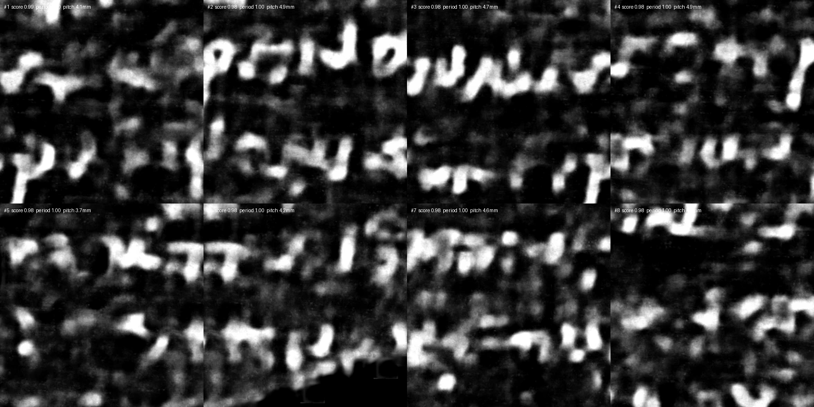

# ScrollScout

**CPU-first ink prospecting for the Vesuvius Challenge.**
Ranks 4 cm² windows of an ink-prediction image (or a raw surface render) by how
much *text-like structure* they contain, so a human — or a GPU budget — only
looks at the most promising regions of the 13 scrolls eligible for the
[First Letters prizes](https://scrollprize.org/prizes#first-letters-prizes).

No training, no GPU, no model weights: classical signal processing on top of
predictions produced by the public `scrollprize/ink_9um` models (or any other).

```
                     GPU (rented / free tier)             CPU (this repo)
 tifxyz segment ──► vc_render_tifxyz ──► ink_9um ──► scrollscout aggregate ──► scrollscout score
                     (surface volume)   (N runs:      (mean / std / consistency)   (ranked 4 cm²
                                        seeds, ckpts,                              windows + heatmap)
                                        depth windows)
```



*Top-8 non-overlapping 10 mm windows on the public `ink_9um` prediction of PHerc0139 w035, ranked by ScrollScout. The detected line pitch (4.7-4.9 mm) is the measured pitch of the scroll's hand.*

**[All results on one page →](docs/results.md)**

## Install

```bash
git clone <this repo> && cd scrollscout
pip install -e .            # numpy, scipy, scikit-image, tifffile, pillow
scrollscout --help
```

## Try it in 30 seconds (no scroll data needed)

```bash
scrollscout synth --out demo                                   # synthetic text / noise / stripes
scrollscout score demo/text_tilted.tif --pixel-size-um 100 --out demo/score_text
scrollscout score demo/noise.tif       --pixel-size-um 100 --out demo/score_noise
```

Text windows score ≈ 0.9–1.0, blobby noise ≈ 0.1–0.3, pure stripes ≈ 0.3.
Each run writes `heatmap.png`, `overlay.png` (top-K boxes) and `windows.json`
(boxes in original pixels **and** millimetres, sub-scores, detected line pitch
and tilt).

## On real data

```bash
# 1. a prediction image from the ink tutorial / ink_9um models (ink bright)
scrollscout score predictions/w035_9um.tif --pixel-size-um 9.362 --out out/w035

# 2. several runs of the same segment (2 seeds x checkpoints x depth windows x directions)
scrollscout aggregate preds/w035_*.tif --out out/w035_ens
scrollscout score out/w035_ens/mean.tif --pixel-size-um 9.362 --out out/w035_ens/score

# 3. the 13 eligible scrolls and where their data lives
scrollscout catalog --ls        # needs `aws` CLI; bucket is public (no account)
```

Useful flags: `--window-mm 20 --stride-mm 5` (prize area), `--pitch-min/--pitch-max`
(expected line spacing, mm), `--letter-min/--letter-max` (letter height, mm),
`--mask` (valid region), `--invert` (ink dark).

## How the score works

**ScrollScout does not detect letters. It measures whether an ink prediction is
geometrically credible as writing**, and ranks windows accordingly.

For every window (default 20 x 20 mm, stride 5 mm, analysed at ~0.1 mm/px), the
foreground is isolated with a local white top-hat at the scale of a letter
stroke, then:

| sub-score | weight | what it measures |
|---|---|---|
| `line_periodicity` | 4 | prominence of the dominant row-projection period inside the expected line-pitch range, over 3 vertical strips (coherence-weighted) and 7 tilt angles |
| `anisotropy` | 1 | row periodicity vs column periodicity: lines are horizontal bands |
| `ink_fraction` | gate | multiplicative veto for implausible coverage (empty windows, smears) — not a ranking term |
| `stroke_shape` | 0 | computed and reported; its sign is not stable across data types |

The weights were **measured, not chosen**: see
[`docs/feature_selection.md`](docs/feature_selection.md). On five real segments
`line_periodicity` separates text from papyrus with no overlap (1.000 vs
0.22-0.28 at the 95th percentile), while `stroke_shape` inverts on real data and
`ink_fraction` takes a single distinct value across 440 windows.

Final score = weighted geometric mean of the voting sub-scores, multiplied by
the ink gate.

**Operating threshold:** a window above 0.6 on a prediction is a candidate;
below 0.5 is background. Measured separation of the final score (95th
percentile): text 0.972-0.973, raw papyrus 0.136-0.297.

## Limits (read before trusting a number)

* This is a **prioritisation** tool, not a letter detector. A high score means
  "worth a human look and a finer render", never "there is text here".
* Thresholds were set on synthetic data and a handful of public predictions.
  Expect to retune `--pitch-*`, `--letter-*` and the ink band per scroll
  (letter size varies between scribes).
* Prediction images must be *programmatically generated*; ScrollScout never
  touches the image content, it only reads it.
* The `ink_9um` models are sensitive to depth offsets — always feed
  `aggregate` several depth windows and look at `consistency.tif`: text that
  appears in only one depth window is suspect.

## Roadmap

- [x] `score`: ranked 4 cm² windows, heatmap, JSON
- [x] `aggregate`: ensemble / depth-sweep diagnostics
- [x] `catalog`: eligible scrolls, S3 paths
- [ ] `render`: wrapper around `vc_render_tifxyz --remote-url` (stream only the chunks a segment touches)
- [ ] `qc`: patch topology checks (sheet-switch / merger detection, fibre continuity) to score segments *before* spending GPU time
- [ ] `sweep`: job generator for ink_9um runs (seeds × checkpoints × depth windows × directions) with a fixed-seed manifest
- [ ] `pack`: submission packager (scale bar, letter sizes, row baselines on a fibre-visible render, mesh ↔ image naming, held-out validation report)

## License & data

Code: MIT. Vesuvius Challenge data is CC BY-NC 4.0 — see https://scrollprize.org/data.
Nothing here is affiliated with or endorsed by Scroll Prize, Inc.
