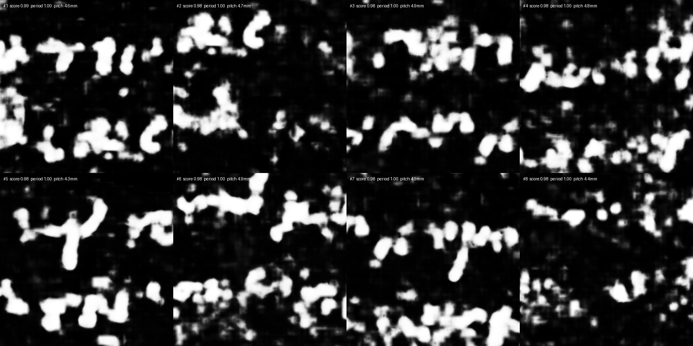
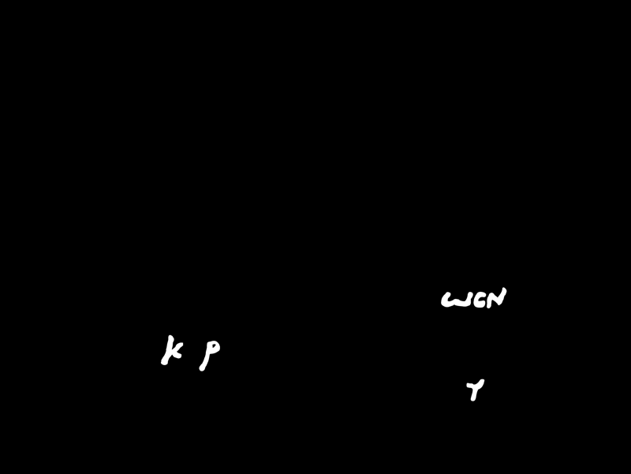

# Six annotated segments of PHerc. 139: what the within-segment benchmark can and cannot say

*The `benchmark-suite` was built to test feature choices across many segments
instead of one. This is its first run on real predictions with real
annotations: the Data Browser's published `canon_2um` ink predictions of
PHerc. 139, against the hand-made labels of the `ink_9um` dataset. It settled
one question, left one open, and exposed a flaw in the benchmark's premise that
is worth more than either.*

## Data

Eight PHerc. 139 segments have both a published 2.399 µm ink prediction
(`segments/<id>/ink-detection/*new_canon_autoresearch_recipe*.tif`) and a label
in `ink_9um`. Predictions were block-averaged 4× to 9.6 µm and paired with the
`native9` label where one exists, the `aligned` label otherwise.

The benchmark's alignment step rejected two of the eight:

| segment | label | alignment peak ratio | kept |
|---|---|---|---|
| w028 | aligned | −0.91 | no — different canvas |
| w029 | aligned | 1.92 | no — different canvas |
| w043 | aligned | 7.72 | yes — same canvas |
| w035, w039, w040, w041, w044 | native9 | 7.2–13.7 | yes |

This is the check working as intended: a benchmark that had silently scored two
misaligned pairs would have reported numbers about nothing.

## Result on the six aligned segments

| ranking | AP mean | σ | diff vs full | W/L | p |
|---|---|---|---|---|---|
| ScrollScout (full, v0.6: periodicity 4 + anisotropy 1) | 0.397 | 0.162 | — | — | — |
| `line_periodicity` alone | 0.397 | 0.164 | +0.001 | 4/2 | 0.44 |
| `anisotropy` alone | 0.373 | 0.132 | −0.024 | 2/4 | 0.44 |
| baseline: raw ink fraction | 0.329 | 0.155 | −0.068 | 3/3 | 0.56 |
| baseline: random | 0.224 | 0.127 | −0.172 | 1/5 | 0.06 |

Per segment:

| segment | label prevalence | AP full | AP random | ratio |
|---|---|---|---|---|
| w044 | 0.15 | 0.575 | 0.200 | 2.9× |
| w041 | 0.11 | 0.358 | 0.127 | 2.8× |
| w039 | 0.10 | 0.269 | 0.103 | 2.6× |
| w035 | 0.36 | 0.504 | 0.328 | 1.5× |
| w040 | 0.40 | 0.514 | 0.426 | 1.2× |
| w043 | 0.15 | 0.160 | 0.160 | **1.0×** |

## Settled: `anisotropy` does nothing

Removing it changes AP by +0.001 with 4 wins and 2 losses. The 0.89-vs-0.61 gap
that kept it in v0.6 was measured on two text segments of one scroll; on six it
is gone. **v0.8 drops it.** The score is now `line_periodicity` times the ink
gate, and on the separation experiment this *improves* the papyrus side
(0.190 → 0.149 at the 95th percentile) while text stays at 1.000.

## Open: within a written segment, ScrollScout is not shown to beat raw ink

+0.068 over ranking by raw ink fraction, but 3 wins, 3 losses, p = 0.56. On
this task, with these labels, the two are indistinguishable. That is the honest
statement, and it stays in the results page.

## The flaw in the premise: w043

w043 is the segment where the tool scores exactly random. Its ranking is not
bad — the top eight windows show clear rows of letterforms at 4.3–4.9 mm pitch,
as clean as anything on w035. Its **label** contains seven letters: κρ, ωϲν and
a γ, in three isolated spots of a 57 × 76 mm segment, everything else black.




*Top: the top-8 windows of w043 by ScrollScout. Bottom: the entire hand label of
w043. The benchmark asks the tool to rank the seven annotated letters above
hundreds of unannotated ones that look the same.*

The `ink_9um` labels are **training labels**: they mark strokes the annotators
were sure of, where the model needed them, and nothing else. They are not a map
of where text is. On a segment where text covers the whole surface, "rank
annotated windows above unannotated ones" is not a question about the tool; it
is a question about which windows the annotator happened to mark, and no
geometric property answers it. Label prevalence in the table above (0.10–0.40)
measures annotation coverage, not text coverage.

The `benchmark.py` docstring already warned that precision would be a lower
bound. What this run shows is that on fully written segments the bound is so
loose that within-segment AP stops being informative in absolute terms. It
remains valid for *comparing* rankings against each other, since every ranking
pays the same penalty — which is why the anisotropy conclusion stands.

## What this means for what the tool is

The question ScrollScout answers well is **"is there text here at all?"** —
between segments, text against papyrus, where periodicity separates with no
overlap and raw ink fraction (1.000 on both classes) separates nothing. The
question it does not answer better than a trivial baseline is **"which part of
this written page is best?"** That is the First Letters question and the
prospecting question respectively, and the tool is for the first.

## What a better within-segment benchmark would need

Dense annotations — every letter marked, on segments where text is present — or,
failing that, segments that contain both written and blank areas so that the
ranking has something real to separate. Neither exists publicly today. Until
then, the cross-segment separation and the seed/model concordance are the
measurements to trust.

## Reproducibility

```bash
bash docs/experiments/fetch_pherc0139_predictions.sh      # ~500 MB from S3
python3 docs/experiments/build_pherc0139_manifest.py       # pairs with ink_9um labels
scrollscout benchmark-suite data/0139_pred/manifest6.json --mode predictions --out out/suite_0139_6
```

Code at tag `v0.8`. The predictions and labels are CC BY-NC 4.0 and are not
committed.
